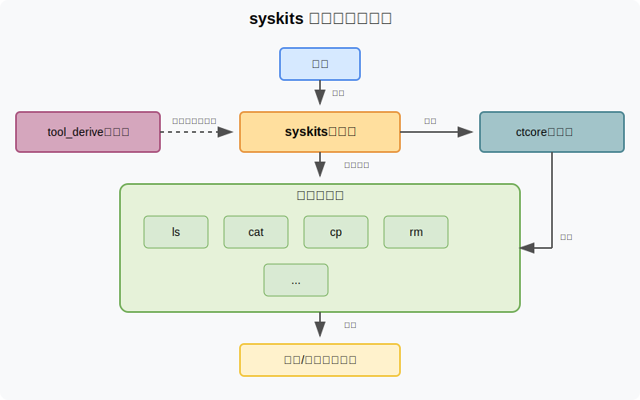

# syskits 项目架构设计 (`ARCHITECTURE.md`)

本文档概述了 `syskits` 项目的整体架构设计，包括核心组件、设计原则、交互模式和数据流。本文档旨在帮助开发者和贡献者理解项目的宏观结构和设计理念。

## 1. 架构概览

### 1.1 设计理念

`syskits` 项目采用了模块化、可扩展的架构设计，遵循以下核心理念：

* **多功能调用二进制文件**：通过单一的可执行文件提供多种工具功能，用户可通过不同入口点（主程序或符号链接）调用不同工具
* **松耦合组件**：各个工具实现为相互独立的 crate，通过统一接口与主程序集成
* **共享核心库**：提供统一的基础设施，避免代码重复
* **条件编译**：支持按需包含特定工具，优化二进制大小

### 1.2 顶层架构图

```
syskits/
│
├── bin/                      # 可执行程序目录
│   ├── syskits/              # 主应用 Crate
│   └── compat_test/          # 兼容性测试工具
│
├── crates/                   # 库组件目录
│   ├── ctcore/               # 核心共享库
│   ├── tool_derive/          # 过程宏 Crate
│   └── commands/             # 工具实现目录
│       ├── ls/               # ls 工具 Crate
│       ├── cat/              # cat 工具 Crate
│       └── ... (90+ 工具)    # 其他工具 Crates
│
└── doc/                      # 文档目录
    ├── PROJECT_RULES.md      # 项目规则与规范
    └── ARCHITECTURE.md       # 架构设计文档（本文件）
```

### 1.3 组件关系图

下面的SVG图展示了各主要组件之间的关系和交互：




该图展示了用户如何与 syskits 交互，以及系统内部各组件之间的关系：

1. 用户通过命令行调用 `syskits` 或其符号链接
2. `syskits` 主应用负责命令分发
3. `tool_derive` 过程宏在编译时为主应用生成工具注册代码  
4. 主应用依赖 `ctcore` 核心库提供的基础设施
5. 各工具实现也依赖 `ctcore` 核心库
6. 执行结果输出到终端或文件系统

## 2. 核心组件详解

### 2.1 `syskits` 主应用 (`bin/syskits/`)

主应用是整个系统的协调中心，负责：

* **命令分发**：根据调用名称或命令行参数确定要执行的工具
* **工具发现与注册**：通过过程宏自动发现和注册所有可用工具
* **全局选项处理**：处理适用于所有工具的全局参数
* **元命令执行**：处理shell补全生成、手册页生成等辅助功能

主应用的内部结构：
```
bin/syskits/
├── Cargo.toml           # 主应用清单文件，定义特性和工具依赖
├── src/
│   ├── main.rs          # 程序入口点，应用过程宏和命令分发逻辑
│   └── bin/
│       └── syskits.rs   # 主二进制实现（可选的替代入口）
└── ...
```

### 2.2 `ctcore` 核心库 (`crates/ctcore/`)

核心库提供共享的基础设施，包括：

* **Tool Trait**：定义所有工具必须实现的统一接口
* **错误处理框架**：`CTError` 和 `CTResult` 类型，提供统一的错误处理机制
* **共享模块**：提供各个工具共用的功能（文件系统操作、字符串处理等）
* **国际化支持**：提供多语言支持的基础设施

核心库内部结构：
```
crates/ctcore/
├── Cargo.toml           # 核心库清单文件
├── src/
│   ├── lib.rs           # 库入口和模块组织
│   ├── tool.rs          # Tool trait 定义
│   ├── error.rs         # 错误处理框架
│   ├── fs/              # 文件系统相关功能
│   ├── display/         # 输出显示相关功能
│   ├── i18n/            # 国际化支持
│   └── ...
└── ...
```

### 2.3 `tool_derive` 过程宏 (`crates/tool_derive/`)

过程宏 Crate 提供编译时代码生成能力：

* **Tools 派生宏**：为主应用的结构体自动生成工具发现和注册的代码
* **编译时工具扫描**：在编译期扫描 `commands/` 目录中的所有工具 Crate
* **条件编译代码生成**：生成带有 `#[cfg]` 标记的工具导入和注册代码

过程宏内部结构：
```
crates/tool_derive/
├── Cargo.toml           # 过程宏清单文件
├── src/
│   └── lib.rs           # 过程宏实现
└── ...
```

### 2.4 工具 Crates (`crates/commands/*/`)

每个命令行工具作为独立的 Crate 实现，遵循统一的结构：

* **Tool 实现**：每个工具 Crate 都实现 `ctcore::Tool` trait
* **命令行接口定义**：使用 `clap` 库定义命令行参数和选项
* **功能逻辑**：实现工具的核心业务逻辑
* **独立可执行文件**：可选地包含独立可执行的入口点

典型工具 Crate 的内部结构：
```
crates/commands/my_tool/
├── Cargo.toml           # 工具清单文件
├── src/
│   ├── lib.rs           # 库入口，包含 Tool trait 实现
│   ├── main.rs          # 独立可执行文件入口（可选）
│   ├── config.rs        # 工具配置管理
│   ├── error.rs         # 工具特定错误类型
│   └── ...              # 工具特定的其他模块
├── tests/               # 集成测试
└── locales/             # 本地化资源文件
```

## 3. 关键交互流程

### 3.1 命令执行流程

1. 用户通过调用 `syskits <tool_name>` 或直接调用符号链接 (如 `ls`) 启动程序
2. 主应用解析程序名称和命令行参数，确定要执行的工具
3. 主应用调用对应工具的 `execute()` 方法，传入命令行参数
4. 工具解析参数，执行核心逻辑，并返回执行结果
5. 主应用处理执行结果（正常退出或显示错误）

### 3.2 工具注册流程

1. 编译时，`#[derive(Tools)]` 过程宏扫描 `commands/` 目录下的所有工具 Crate
2. 过程宏查找每个工具 Crate 中实现了 `ctcore::Tool` trait 的公共结构体
3. 过程宏根据每个工具的 `name()` 方法返回值，生成工具注册代码（带有相应的 `#[cfg]` 标记）
4. 生成的代码包含在主应用中，用于运行时的命令分发

### 3.3 错误处理流程

1. 工具执行过程中遇到错误，封装为实现了 `CTError` trait 的错误类型
2. 通过 `?` 运算符或显式返回将错误传播到 `execute()` 方法
3. 主应用接收错误，调用其 `code()` 方法获取退出码
4. 主应用显示错误信息，以对应的退出码退出程序

## 4. 扩展性设计

### 4.1 添加新工具

`syskits` 架构设计支持以最小改动添加新工具：

1. 在 `crates/commands/` 创建新的工具目录和 Crate
2. 实现 `ctcore::Tool` trait
3. 在 `bin/syskits/Cargo.toml` 添加工具依赖和特性
4. 过程宏自动处理工具注册，无需修改主应用代码

### 4.2 特性标记

项目使用 Cargo 特性来控制哪些工具被包含在最终的二进制文件中：

* **工具特性**：每个工具对应主应用中的一个特性（与工具名称相同）
* **功能特性**：某些工具可能定义额外的特性，启用额外功能
* **核心特性**：`ctcore` 也支持特性，工具可以选择性地启用所需功能

### 4.3 插件化架构

虽然 `syskits` 目前是静态链接的，但其架构设计为未来的插件化扩展提供了基础：

* **统一接口**：所有工具都实现相同的 `Tool` trait
* **松耦合设计**：工具之间几乎没有直接依赖
* **注册机制**：主应用通过通用机制发现和调用工具

## 5. 构建与部署

### 5.1 构建配置

`syskits` 支持多种构建配置，通过根 `Cargo.toml` 中的 `[profile]` 部分定义：

* **release**：标准优化发布构建
* **release-fast**：优化速度的发布构建
* **release-small**：优化大小的发布构建

### 5.2 符号链接部署

`syskits` 设计支持通过符号链接调用不同工具：

1. 安装 `syskits` 主可执行文件到标准位置（如 `/usr/bin/syskits`）
2. 为每个支持的工具创建符号链接（如 `/usr/bin/ls -> /usr/bin/syskits`）
3. 当通过符号链接调用时，主应用检测调用名称并执行对应工具

## 6. 设计原则与考量

### 6.1 关键设计决策

* **为何使用多功能调用二进制**：减少磁盘空间占用，共享基础代码，统一用户体验
* **为何将工具实现为独立 Crate**：模块化组织，独立开发和测试，清晰的责任边界
* **为何使用过程宏**：减少手动代码维护，自动化工具发现和注册，减少人为错误

### 6.2 性能考量

* **二进制大小**：通过特性标记控制包含的工具，优化二进制大小
* **启动性能**：共享运行时和库代码，减少重复加载
* **执行效率**：每个工具可以独立优化其核心算法，而不影响其他工具

### 6.3 未来发展方向

* **动态加载**：潜在支持动态加载工具模块，进一步减小基本二进制大小
* **扩展 API**：为第三方开发者提供稳定的 API，支持自定义工具的开发
* **分布式部署**：支持工具远程执行或网络协作模式